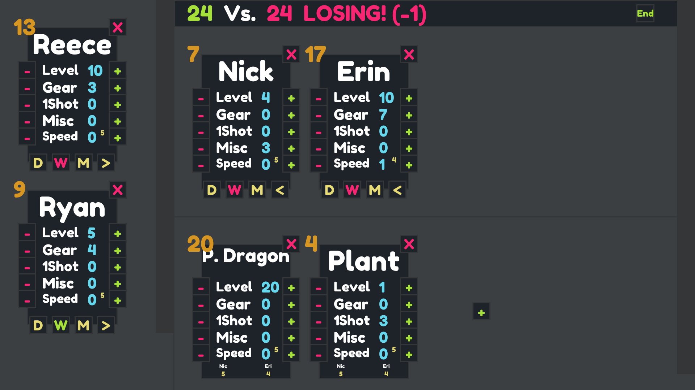

# Table Top RPG Level Counter

An application for tracking stats and levels for the Steve Jackson Games table top game, *Munchkin*.

## Installation

`pip install -r requirements.txt`  
`python main.py`

## Usage

Players can be added with the `+` button and named by clicking on the randomly chosen name, entering a new name, and pressing enter. Players can be removed by pressing the `x` button top right of each player.

Warrior status can be set by pressing the `W` button at the bottom of a player card. Gender can be toggled between `M`, `F`, `N`, and `B` (for Male, Female, Neither/Non-binary, and Both -- just in case that one is somehow possible in Munchkin).

The Combat Strength number in the top left of a player card is the sum of the player's Level, Gear, 1Shot, and Misc. Misc and Gear are functionally equivalent and are separated for the players' organizational convenience.

Players can enter combat by pressing the `>` button. Monsters can be added to the combat by pressing the resulting `+` in the combat area on the right side of the screen. The `x` button top right of each monster allows the user to remove the monster from combat. The sum of the participating players' is shown at the top of the screen in green and the sum of the monsters' combat strength is shown in magenta. The number of points needed by the players to tip the balance of combat is shown in parentheses.

Combat can be ended by either removing each participating player with the `<` button or by pressing the `End` button at the top right during combat. The `End` button will automatically clear the 1Shot stat for each participating player.

Every "+1 to runaway" for a player can be recorded by increasing the Speed stat. The small number top right of the Speed stat is the minimum roll required for the player to successfully run away. When in combat, monsters also have a speed stat which can be increased when a specific monster offers a "+1 to runaway" bonus. The bottom of each monster card shows the runaway roll required to successfully runaway for each player for that monster. It is the sum of the monster's speed stat and each player's.

## Notes

Fullscreen the application with `F11` and close it with `Escape`. The last game is automatically saved when closed and automatically loaded when relaunched.

## Disclaimer

Munchkin™ is a trademark of Steve Jackson Games, and its rules and art are copyrighted by Steve Jackson Games. All rights are reserved by Steve Jackson Games. This game aid is the original creation of Reece Mathews and is released for free distribution, and not for resale, under the permissions granted in the [Steve Jackson Games Online Policy]("http://www.sjgames.com/general/online_policy.html").